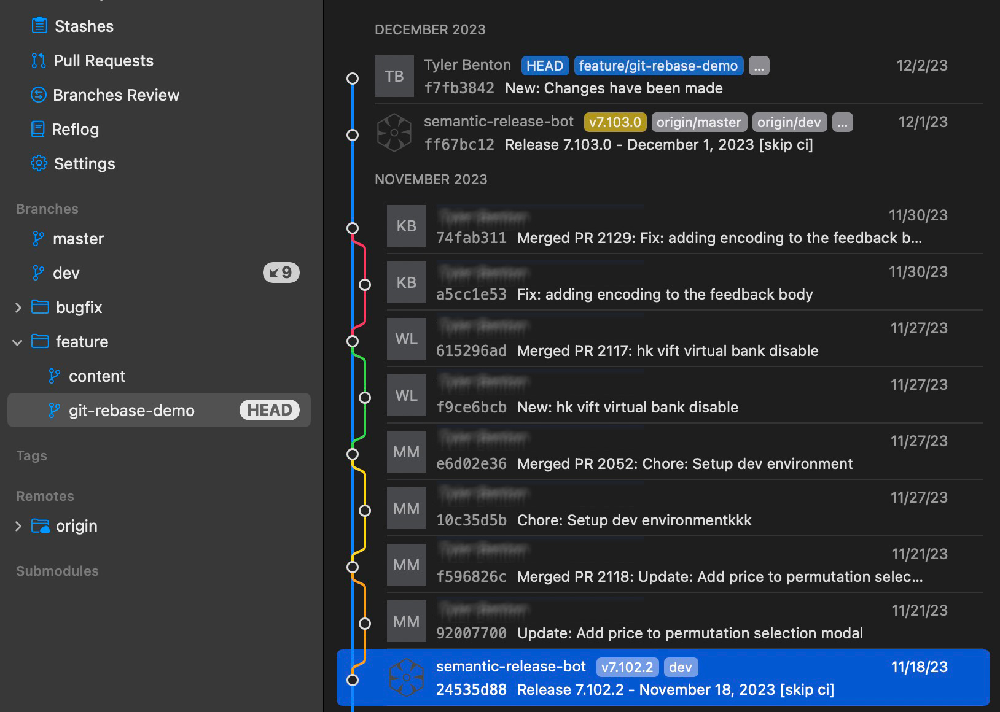

# Rebase

The easiest way to explain `git rebase` is that it essentially takes your local commits, and stores them in a temporary stash, pulls in the latest changes from the remote, then applies the temporary stash at the top of the git history.

If you don't use rebase you can end up with a git history that looks like the below screenshot, and unless you have a PHD in git, this type of git history will be useless to you.


To fix the above git history hell you want to use `git rebase` and the `Semi-linear merge` strategy when you're merging pull requests. 
The combination of these methods allows you to keep your git history under control and allows you to easily see each PR that has been merged. 


## Example

An example of what the rebase strategy will look like is below. I'll break down a few things you can see in this example:


  
  - You can see there were 3 releases
  
  
  - Between 7.100.3 and 7.100.4 there was only 1 PR
  
  
  - Between 7.100.4 and 7.101.0 there were 3 PRs
  
  
  - On one of the PRs between 7.100.4 and 7.101.0 you can also see that multiple people had commits on that PR
  


You can see above when a PR is merged it will keep all the commits for each PR together so you can easily **Reset** the HEAD back to each PRs or releases if you need to debug an issue that came up in a recent release that was not there before. 

## How to

> I am using one of my projects so you can see the full rebase strategy where the `dev` branch is the main branch that all PRs get merged into. The `master` branch holds the latest release of the app.

- Make sure that you have your `origin/dev` branch pulled down locally and be sure that you are tracking it to be able to see when PRs are merged.
  

- When you create a new local branch make sure you always branch off your `dev` branch because that will always be the most up to date.

- Below you can see what it looks like when your local `dev` branch is behind the the `origin/dev` branch on the remote. 


- Instead of switching to your local `dev` branch and pulling down the new changes immediately, you will want to switch to each of your local working branches (not just branches you are reviewing) and pull in the changes using the rebase method instead of merge. 

- When pulling down down the latest changes from `origin/dev` into your local branch `feature/git-rebase-demo` you'll want to make sure that you have the `Use Rebase instead of Merge` selected. Each git client is slightly different but all of them support **rebase**. 


### Scenarios

Once you get to this point there's a few different scenarios that can happen so I'll try and cover each of them. To make it easier to see what the most recent commit message is in your local `dev` branch I will highlight it in blue and is the commit message from the **release 7.102.2**. 

> Note that from here on out when `pull` in changes is mentioned it is always referring to pulling in changes from `origin/dev` into the local branch `feature/git-rebase-demo` using rebase instead of merge shown above.


##### Scenario 1

You have just created a new local `feature/git-rebase-demo`  branch and have not pushed it to the remote and have not made any commit messages yet.

  - Below you can see that the latest commit on the local `feature/git-rebase-demo` branch matches the latest commit message that you have in your local `dev` branch. 
  

  - This is the easiest scenario because you can just pull in changes without having to do anything else. Below is what it will look like after you pull in `dev`
  


##### Scenario 2

You have a local branch `feature/git-rebase-demo` that hasn't been pushed to the remote. You have **1+** commits, and there are no conflicts.

  - Here's what it looks like before you pull in `origin/dev`. You can see that your local branch has **1** commit message (*New: Changes have been made*) above the latest changes that you have in your local `dev` branch. 
  

  - After you pull in `origin/dev` into your local `feature/git-rebase-demo` branch, your git history will look like this. As you can see the release commit of **7.102.2** has moved down and your commit message of (*New: Changes have been made*) stayed at the top of the git history. 
  


##### Scenario 3

Same as [scenario 2](#scenario-2) except you had already pushed your local branch `feature/git-rebase-demo` to the remote before pulling in changes from `origin/dev`.

  - When you push a new local branch to the remote always ensure that you enable tracking for the branch.
  

  - Before you pull in `origin/dev` it will look exactly the same as it did in Scenario 2 before you pull in dev.
  

  - After you pull in `origin/dev` into your local `feature/git-rebase-demo` you will end up with a git history that looks like the below. 
  

> Without understanding what you are looking at this can look daunting, which can be the reason why some developers shy away from using the `git rebase` method. So I'll break down what is going on the best I can to help you understand that it is not as complex as it looks.

  - You can see that these commits with the :arrow_upper_right: are **ahead** of the remote `feature/git-rebase-demo` and that all of them are the same **9** commits that you pulled in from `origin/dev`.
  

  - The **:arrow_upper_right: 10** indicates the number of commits that the local branch is **ahead** of the remote branch. In other words the number of commits that can be pushed to the remote.
  

  - The **:arrow_upper_right: 10** indicates the number of commits that the local branch is **ahead** of the remote branch. In other words the the number of commits that can be pushed to the remote. 
  

  - The **:arrow_lower_left: 1** indicates the number of commits that the local branch is **behind** of the remote. In other words it's the number of commits you can pull down from the remote. If you would have pushed **5** commits on the remote branch then this would be be **:arrow_lower_left: 5**. From this state if you do another pull from the remote `feature/git-rebase-demo` you will end up in the same state you were before you attempted to pull in `origin/dev`.
  

  - Note that this number (**:arrow_upper_right: 10** in this case) will always be the total number commits that you pulled down from `origin/dev` (in this case **9**), plus the number of commits that you've made on your current branch (in this case **1**).

  - At the top you will end up seeing duplicate commits that you have made to your branch `feature/git-rebase-demo`. In this case there was **1** commit so you will see **:arrow_upper_right: 1** and **:arrow_lower_left: 1**. If you would have done **5** commits it would show **:arrow_upper_right: 5** and **:arrow_lower_left: 5**. These are duplicated because the commits are showing on both local and on the remote. In the git history you can see the lines are not connected because they are the same commits.
  

  - Now that you understand what you are looking at you can go ahead and push your changes to the remote branch `feature/git-rebase-demo`. When you already have commits you've pushed to the remote branch you will have to overwrite them by using a **force push**.
  

  - Note that if you do not select **force push** before you attempt to push to the remote you will end up getting an error like the below. If you see this, just know that all you need to do is push again and just make sure that you select `force push`.
  

  - After you successfully **force push** your changes to the remote you will end up with a git history that looks exactly like it did at the end of [scenario 2](#scenario-2)
  


##### Scenario 4

You have a local branch `feature/git-rebase-demo` but it has not been pushed to the remote. You have **1+** commits, that causes a merge conflict when pulling in `origin/dev`. 

  - Here's what it looks like before you pull in `origin/dev`. You can see that your local branch has **1** commit message (*New: Commit with merge conflicts*) above the latest changes that you have in your local `dev` branch. 
  
 
  - When you try to pull in `origin/dev` and you have a merge conflict you will see a warning telling you about it before you `pull` in `origin/dev`
  
  
  - After you `pull` in `origin/dev` you'll see this screen. In this example there was just a single merge conflict that needs to be resolve so go about resolving merge conflicts the same way you normally do. If you only have a hand full of merge conflicts it is typically easier to just resolve them.
  
  
  - After you resolve the merge conflicts you will end up with a git history that looks exactly like it did at the end of [scenario 2](#scenario-2).
  


##### Scenario 5

This is the most complex case you will encounter. It is a combination of [scenario 3](#scenario-3) and [scenario 4](#scenario-4). You have pushed your local branch `feature/git-rebase-demo` to the remote, and it has a merge conflict because your branch `feature/git-rebase-demo` branch has changes in it that the `origin/dev` already changed.

  - Here's what it looks like before you pull in `origin/dev`. You can see that your local branch has **1** commit message (*New: Multiple changes with a merge conflict*) above the latest changes that you have in your local `dev` branch. 
  
  
  - When you try to pull in `origin/dev` and you have a merge conflict you will see a warning telling you about it before you `pull`.
  
  
  - After you `pull` in `origin/dev` you will see this screen. There were multiple files changed in the commit (*New: Multiple changes with a merge conflict*). You can see that the files that did not have merge conflicts do not show up here, only the ones with merge conflicts. Resolve the merge conflicts same as in [scenario 4](#scenario-4).
  
  
  - After you resolve the merge conflicts you will end up with a git history that looks exactly like it did at the end of [scenario 3](#scenario-3). If you do not understand what is going on here refer back to [scenario 3](#scenario-3) for an in-depth explanation.
  
  
  - Once you get to this point you will continue to **force push** part of [scenario 3](#scenario-3). 
  

  - After you **force push** you will end up in the same state as the other scenarios above.
  


<div style="height: 20px"></div>


After you complete your scenario you will switch branches to your local `dev` branch and finally pull down the **:arrow_lower_left: 9** changes from the `origin/dev`. Once you've done this you're done pulling in changes and can continue work as usual. 

<div style="border-top: 1px solid gray; flex: 1; margin: 20px 0;"></div>

If you follow these steps you should not have any issues. What I typically have **new developers** do when they are first learning this git rebase method is have them make a local backup of their branch. So in this case they would make a back up copy of `feature/git-rebase-demo` and name it `feature/git-rebase-demo-copy`. Then switch back to the original `feature/git-rebase-demo` branch and proceed with the steps above. This ensures that they will not lose any of their code, just in case there is a missed step and something goes wrong.

Once you do this a few times and get used to it, it will become a normal process and everything you see on the screen when rebasing `origin/dev` into your branch will essentially become white noise and you can ignore all the details. However, it is still important to understand the details.


<div style="height: 25px"></div>


## Strategies 

With this **rebase** strategy it makes your git history clean and easy to read and rebase commits. You will still end up running into merge conflicts from time to time like you would using other git strategies. For the most part you can avoid them. Here is a list of general guidelines I use as best practices, this can also help mitigate merge conflicts and keep your git history clean and easy to use.


#### Commit early and often. 

  - This doesn't mean you should have **30** commits for each PR. Instead you can utilize git `amend` to keep the commits down. When you need to you can still break your PR down multiple commit messages. Most of the time for normal PRs you will have **1-3** commits and those are typically the initial code changes, PR fixes, and tests as separate commits. 
  
  - If you have more than **6** commits, either your PR is too big and should be broken down in to smaller more scoped PRs or you did not use `git amend`. 
  
  - You can also optionally do as many commits as you want and then before you open your PR you can **squash** all the commits you have made into **1** commit. 


#### Pull in `origin/dev` often
  - Pull in changes from `dev` branch into each of your working branches as soon as you see a PR has been merged instead of waiting until open a PR.
  
  - Before you open up a new PR make it a habit to pull in `origin/dev`. This is a good habit to get into to ensure your PR is up to date with dev before reviewers test code changes and if there are merge conflicts you can go ahead and take care of them.


#### Avoid scope creep

This means that each PR will focus on fixing 1 main issue and not multiples in the same PR. 

  - It's better to have separate PRs that have smaller scopes than doing a single PR that touches multiple issues. Doing it this way will also get PRs merged faster.

  - There are sometimes it makes more sense to handle multiple things in 1 PR than in 2 different PRs. For example, when the time comes to update packages I don't just open a separate PR for each package that needs to be updated. Instead, I find it easier to upgrade as many packages as I can that do not require code changes or only require a few lines of changes. Then, I do a separate PR for the packages that require lots of changes because they reworked something (`react-navigation` comes to mind). This allows the first PR with minimal changes for upgrades to be merged first, and then you can focus on the second PR that requires more changes.

  - If you are working a specific issue and come across an unrelated bug, do not just add that fix to your current PR. Instead, open an github issue for that repo and make a separate branch and PR for that bugfix.


##### Coordinate global changes

Coordinate work with other developers when possible to avoid merge conflicts. 
  
  - If you are planning on making a global change that is going to require a PR that will modify lots of files. You will want to avoid starting on a another PR that's going to cause different global changes. You will end up in git **merge hell** every time. Instead, wait until the first one is merged then start your next PR that has global changes.

  - For the most part coordinating is really easy to do if you scope your PRs as mentioned above. The only time this becomes seemingly impossible to do is when you are upgrading some packages or making global changes. Here's a few cases where it is harder to avoid merge conflicts.

    - Updating your eslint config to change some rules to fit your projects development flow better. You will end up having changes in most, if not all, the js files in your project depending on the rule change. 
    
    - Upgrading react navigation. Some updates for this package require global changes in all screens. 
    
    - Updating react/react-native will always have challenges and sometimes require global changes to multiple files.
    
    - A great example your going to come across is changing how you handle text in the app. You will end up having to touch most of your files to import your new global project specific `Text` component so that you can have a base `Text` component that is used throughout the app. This makes it easy to change the entire app's appearance quickly instead of having to change them file by file.
    ```js
    import { Text } from 'react-native-animatable'
    import { Text } from 'react-native'
    import { Text } from 'native-base'

    // changes to be from your global components
    import { Text } from '../components'
    ```

  - When changing linting, updating packages, or other global changes. Sometimes it can be a nightmare with to many merge conflicts to handle easily. If this happens to you, take a step back and asses the situation. Sometimes its easier to just do the following on your local `feature/git-rebase-demo` branch that's already been pushed to the remote.
  
    - **rebase** back to before any of your changes were made (latest commit in your local `dev`) then stash those changes.
    
    - **force push** your local branch (`feature/git-rebase-demo`) to the remote to set it back to the same commit your local `dev` branch is at. 
    
    - Pull in `origin/dev` into your local branch `feature/git-rebase-demo`.
    
    - **force push** the changes to the remote `feature/git-rebase-demo`.
    
    - Apply your saved **stash**, or copy your code code manually from your stash and put it back into your local branch.
    
    - Commit the changes from the **stash** and push to the remote again.

  > Note that these are edge cases but you should be aware of it in case you do run into a merge conflict that you can't seem to get past. 

